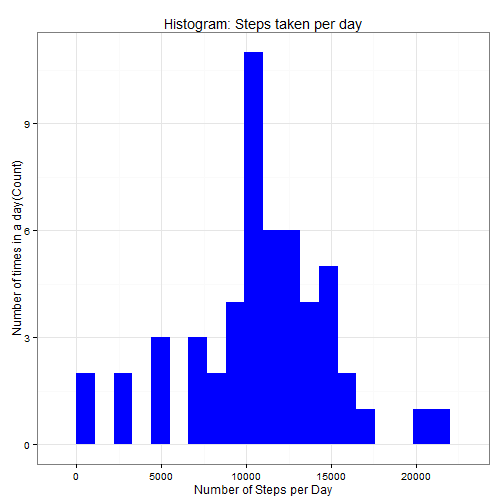
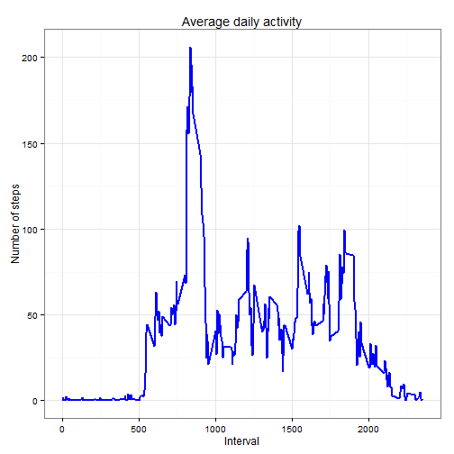
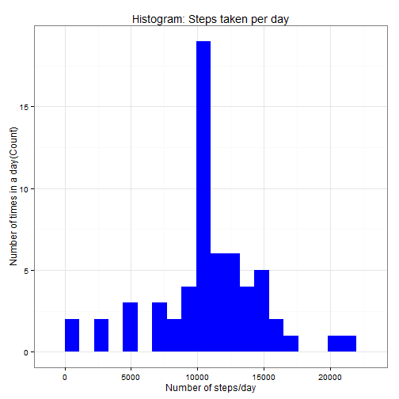

Reproducible Research - Peer assessment 1
========================================================

By Juan Carlos Lopez Hernandez                          Date: 15 May 2015


Introduction
============

The assigment makes use of data from a personal activity monitoring device. This device collects data at 5 minute intervals through out the day. The data consists of two months of data from an anonymous individual collected during the months of October and November, 2012 and include the number of steps taken in 5 minute intervals each day.

I write a report that try to answer the questions detailed in this document. This report presents the results in a single **R markdown document** that can be processed by knitr and be transformed into an HTML file.


R Enviroment
============

We need to load some libraries. We use ggplot2 for plotting figures


```r
library(knitr)
library(data.table)
library(ggplot2) 
```

Also, When I write code chunks in the R markdown document, we always use **echo = TRUE** so everybody will be able to read the code.


```r
opts_chunk$set(echo = TRUE, results = 'hold')
```


Loading and preprocessing the data
==================================

The dataset is stored in a *CSV file*. This dataset contains a total of 17,568 observations.

Dataset: Activity monitoring data [52K]
The variables included in this dataset are:

**steps**: Number of steps taking in a 5-minute interval (missing values are coded as NA).

**date**: The date on which the measurement was taken in YYYY-MM-DD format.

**interval**: Identifier for the 5-minute interval in which measurement was taken.

**NOTE**: The GitHub repository also contains the dataset for the assignment so you do not have to download the data separately. If you want to download the data yo can put the file in the current working directory

Setting working directory and reading data file


```r
setwd("C:/Users/user/Documents/R/5 Reproducible Research/Data_Activity")

data_activity <- read.csv('activity.csv', header = TRUE, sep = ",",
                          colClasses=c("numeric", "character", "numeric")
                         )
```

We convert the date field into to Date class. 
Also we convert the Interval field to Factor class.


```r
data_activity$date <- as.Date(data_activity$date, format = "%Y-%m-%d")
data_activity$interval <- as.factor(data_activity$interval)
```

We check data using str():


```r
str(data_activity)
```

```
## 'data.frame':	17568 obs. of  3 variables:
##  $ steps   : num  NA NA NA NA NA NA NA NA NA NA ...
##  $ date    : Date, format: "2012-10-01" "2012-10-01" ...
##  $ interval: Factor w/ 288 levels "0","5","10","15",..: 1 2 3 4 5 6 7 8 9 10 ...
```

and summary() methods


```r
summary(data_activity)
```

```
##      steps             date               interval    
##  Min.   :  0.00   Min.   :2012-10-01   0      :   61  
##  1st Qu.:  0.00   1st Qu.:2012-10-16   5      :   61  
##  Median :  0.00   Median :2012-10-31   10     :   61  
##  Mean   : 37.38   Mean   :2012-10-31   15     :   61  
##  3rd Qu.: 12.00   3rd Qu.:2012-11-15   20     :   61  
##  Max.   :806.00   Max.   :2012-11-30   25     :   61  
##  NA's   :2304                          (Other):17202
```


What is mean total number of steps taken per day?
=================================================

For answer this question we ignore the missing values.
First, We must calculate the total steps per day.


```r
number_steps_day <- aggregate(steps ~ date, data_activity, sum)
colnames(number_steps_day) <- c("date","steps")
head(number_steps_day)
```

```
##         date steps
## 1 2012-10-02   126
## 2 2012-10-03 11352
## 3 2012-10-04 12116
## 4 2012-10-05 13294
## 5 2012-10-06 15420
## 6 2012-10-07 11015
```

Now we calculate the mean and median of the number of steps taken per day.
We exclude missing values from analyses of mean & median:


```r
steps_mean   <- mean(number_steps_day$steps, na.rm=TRUE)
steps_median <- median(number_steps_day$steps, na.rm=TRUE)
paste("The mean total number of steps taken per day is:",steps_mean)
paste("And the median total number of steps taken per day is:",steps_median)
```

```
## [1] "The mean total number of steps taken per day is: 10766.1886792453"
## [1] "And the median total number of steps taken per day is: 10765"
```

We make at this moment an histogram of the total number of steps taken per day, plotted with appropriate bin interval.


```r
ggplot(number_steps_day, aes(x = steps)) + 
       geom_histogram(fill = "blue", binwidth = 1100) + 
        labs(title="Histogram: Steps taken per day", 
             x = "Number of steps/day", y = "Number of times in a day(Count)") + theme_bw() 
```

 


What is the average daily activity pattern?
===========================================

1. We make the plot with the time series of the average number of steps taken, averaged across all days (y-axis):


```r
steps_per_interval <- aggregate(data_activity$steps, 
                                by = list(interval = data_activity$interval),
                                FUN=mean, na.rm=TRUE)

#We convert values to integers for helping in plotting

steps_per_interval$interval <- 
        as.integer(levels(steps_per_interval$interval)[steps_per_interval$interval])
colnames(steps_per_interval) <- c("interval", "steps")
```


```r
ggplot(steps_per_interval, aes(x=interval, y=steps)) +   
        geom_line(color="blue", size=1) +  
        labs(title="Average daily activity", x="Interval", y="Number of steps") +  
        theme_bw()
```

 


1. We need to answer: Which 5-minute interval, on average across all the days in the dataset, contains the maximum number of steps?

First, we calculate the 5-minute interval with the containing the maximum number of steps: 

```r
max_interval <- steps_per_interval[which.max(steps_per_interval$steps),]
paste("The interval ",as.character(max_interval[,"interval"]),"th has maximum ",as.character(max_interval[,"steps"])," steps.")
```

```
## [1] "The interval  835 th has maximum  206.169811320755  steps."
```

Imputing missing values
=======================

Note that there are a number of days/intervals where there are missing values (coded as NA). The presence of missing days may introduce bias into some calculations or summaries of the data.

* Calculte and report the total nuber of misssing values:

```r
na_values <- sum(is.na(data_activity$steps))
paste("There are a total of ",as.character(na_values)," NA's values")
```

```
## [1] "There are a total of  2304  NA's values"
```

* Devise a strategy for filling in all of the missing values in the dataset.

To fill missing values, we choose a strategy very simple. It consists in replace the missing values with the mean value at the same interval across days.

First, we create a function fill_na_values(data, pervalue) which the data arguement is the activity data frame and pervalue argument is the steps_per_interval data frame:


```r
fill_na_values <- function(data_activity, pervalue) {
        na_index <- which(is.na(data_activity$steps))
        na_replace <- unlist(lapply(na_index, FUN=function(idx){
                interval = data_activity[idx,]$interval
                pervalue[pervalue$interval == interval,]$steps
        }))
        fill_navalues <- data_activity$steps
        fill_navalues[na_index] <- na_replace
        fill_navalues
}

data_activity_fill <- data.frame(  
        steps = fill_na_values(data_activity, steps_per_interval),  
        date = data_activity$date,  
        interval = data_activity$interval)
```

* Create a new dataset that is equal to the original dataset but with the missing data filled in.
We must check that there are the same number of observations and there are not missing values for steps column.


```r
str(data_activity_fill)

sum(is.na(data_activity_fill$steps))
```

```
## 'data.frame':	17568 obs. of  3 variables:
##  $ steps   : num  1.717 0.3396 0.1321 0.1509 0.0755 ...
##  $ date    : Date, format: "2012-10-01" "2012-10-01" ...
##  $ interval: Factor w/ 288 levels "0","5","10","15",..: 1 2 3 4 5 6 7 8 9 10 ...
## [1] 0
```

* Make a histogram of the total number of steps taken each day and calculate and report the mean and median total number of steps taken per day. Do these values differ from the estimates from the first part of the assignment? What is the impact of imputing missing data on the estimates of the total daily number of steps?

We make at this moment another histogram of the total number of steps taken per day, plotted with appropriate bin interval.


```r
fill_number_steps_day <- aggregate(steps ~ date, data_activity_fill, sum)
colnames(fill_number_steps_day) <- c("date","steps")

##plotting histogram
ggplot(fill_number_steps_day, aes(x = steps)) + 
       geom_histogram(fill = "blue", binwidth = 1100) + 
        labs(title="Histogram: Steps taken per day", 
             x = "Number of steps/day", y = "Number of times in a day(Count)") + theme_bw() 
```

 


```r
steps_mean_fill   <- mean(fill_number_steps_day$steps, na.rm=TRUE)
steps_median_fill <- median(fill_number_steps_day$steps, na.rm=TRUE)
paste("The fill mean total number of steps taken per day is:",steps_mean_fill)
paste("And the fill median total number of steps taken per day is:",steps_median_fill)
```

```
## [1] "The fill mean total number of steps taken per day is: 10766.1886792453"
## [1] "And the fill median total number of steps taken per day is: 10766.1886792453"
```

We can see that the values after filling the data mean and median are equal and differs with the estimates at the first part.


Are there differences in activity patterns between weekdays and weekends?
=========================================================================

For this part the weekdays() function may be of some help here. Use the dataset with the filled-in missing values for this part.

We use the last table with filled-in missing values.

* Create a new factor variable in the dataset with two levels: *weekday* and *weekend* indicating if a given date is a weekday or weekend day.


```r
weekdays_steps <- function(data) {
    weekdays_steps <- aggregate(data$steps, by=list(interval = data$interval), FUN=mean, na.rm=TRUE)
    # convert to integers for plotting
    weekdays_steps$interval <- as.integer(levels(weekdays_steps$interval)[weekdays_steps$interval])
    colnames(weekdays_steps) <- c("interval", "steps")
    weekdays_steps
}

data_by_weekdays <- function(data) {
    data$weekday <- as.factor(weekdays(data$date)) # weekdays
    weekend_data <- subset(data, weekday %in% c("saturday","sunday"))
    weekday_data <- subset(data, !weekday %in% c("saturday","sunday"))

    weekend_steps <- weekdays_steps(weekend_data)
    weekday_steps <- weekdays_steps(weekday_data)

    weekend_steps$dayofweek <- rep("weekend", nrow(weekend_steps))
    weekday_steps$dayofweek <- rep("weekday", nrow(weekday_steps))

    data_by_weekdays <- rbind(weekend_steps, weekday_steps)
    data_by_weekdays$dayofweek <- as.factor(data_by_weekdays$dayofweek)
    data_by_weekdays
}

data_weekdays <- data_by_weekdays(data_activity_fill)
```

```
## Error in aggregate.data.frame(as.data.frame(x), ...): no rows to aggregate
```

Sorry!!! It does'nt work

* Make a panel plot containing a time series plot (i.e. type = l) of the 5-minute interval (x-axis) and the average number of steps taken, averaged across all weekday days or weekend days (y-axis).


